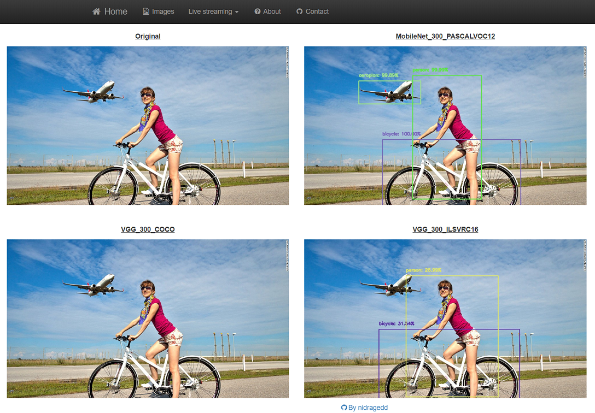
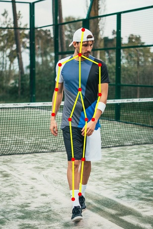

# Computer Vision experiments
Goal of this project is to explore Computer Vision with OpenCV and Python. A lot of this work is based on very good tutorials
proposed by Dr. Adrian Rosebrock on his wonderful blog [pyimagesearch](https://www.pyimagesearch.com/).

## Table of contents
* [1. Technical Section](#1-technical-section)
* [2. Context - Objectives](#2-context---objectives)
* [3. Object Detection](#3-object-detection)
* [4. Pose Estimation](#4-keypoint-detection)

---

## 1. TECHNICAL SECTION
### Dependencies & Installation - Create your CONDA virtual environment
Easiest way is to create a virtual environment through **[conda](https://docs.conda.io/en/latest/)**
and the given `environment.yml` file by running this command in a terminal (if you have conda, obviously):
```
conda env create -f environment.yml
```

If you do not have/want to use conda for any reason, you can still setup your environment by running some `pip install`
commands. Please refer to the `environment.yml` file to see what are the dependencies you will need to install.  
Basically, this project requires **Python 3.7** in addition to common image manipulation packages (such as 
[opencv 4.x](https://opencv.org/) (note that [numpy](https://www.numpy.org/) will be required), [PIL](https://pillow.readthedocs.io/en/stable/)).

There are those additional packages in order to expose our work within a webapp:
* [Flask](https://palletsprojects.com/p/flask/): used as web application framework/engine to run the app over HTTP

### Directory & code structure
Here is the structure of the project:
```
    project
      |__ config    (configuration section, so far it contains JSON files used to configure logging or the program)
            |__ detection   (folder to contain detection classes)
            |__ pose        (folder to contain pose estimation classes)
      |__ models    (contains downloaded pre-trained models)
      |__ src       (python modules and scripts)
            |__ config      (scripts called to actually configure the program)
            |__ detection   (scripts called to perform object or motion detection)
            |__ models      (wrappers classes for models)
            |__ motion      (scripts called to do read & stream live motion detection)
            |__ pose        (scripts called to perform pose estimation)
            |__ static      (HTML static resources to serve through Flask)
            |__ templates   (HTML templates to serve through Flask, this is the 'view' part)
            |__ utils       (python helper & utility functions)
            |__ webapp      (python files corresponding to the webapp: this is the 'controller' part)
            |__ app.py      (script called to run the Flask server)
            |__ main_xxx.py (main scripts to test a specific functionality)
```

### Run the app on your local computer
1. Run the following command in the project's root directory to run the web app.
    `python src/app.py -i 0.0.0.0 -p 3001 -c <path_to_config.json_file> -l <path_to_log_config_file>`
Then go to http://0.0.0.0:3001/ or [http://localhost:3001/](http://localhost:3001/) with your favorite browser

2. You can launch specific functionality with some `main_xxx` python scripts. They are all under project's src directory.
***PAY ATTENTION*** to mandatory arguments if any (have a look at the argparse configuration)

The webapp should look like something like this:  


### Configuration section
This project can be fully configured through 2 external JSON files:
* `logging.json`: external configuration for logging module parameters(loggers, parsers, appenders, file handlers).
* `config.json`: homemade file where all parameters are provided. Please refer to this [file](config/CONFIG.md) for more details about it.

A default (and working) version of those files is provided under the `config` directory in project's root directory.

---
## 2. CONTEXT & OBJECTIVES
As a regular reader of Adrian Rosebrock [pyimagesearch blog](https://www.pyimagesearch.com/) or [learnopencv](https://www.learnopencv.com/), I wanted to give a try to some of the great tutorials
but in such a way that everything remains available in a single place and, if and when possible, with factorized code.  
That is why a lot of what you can read in this project comes from there (plus some additional research).  
I have made the effort to propose the different functions within a webapp that you can run on your computer.

---
## 3. OBJECT DETECTION
### Resources
* [pyimagesearch: object detection with SSD300](https://www.pyimagesearch.com/2017/09/11/object-detection-with-deep-learning-and-opencv)
* [pyimagesearch: object detection with YOLO](https://www.pyimagesearch.com/2018/11/12/yolo-object-detection-with-opencv)
* [towardsdatascience: review of what is a Single Shot Detector](https://towardsdatascience.com/review-ssd-single-shot-detector-object-detection-851a94607d11)
* [Another medium post on SSD multibox detection](https://medium.com/@jonathan_hui/ssd-object-detection-single-shot-multibox-detector-for-real-time-processing-9bd8deac0e06)
* [AI Google blog: review of MobileNetV3](https://ai.googleblog.com/2019/11/introducing-next-generation-on-device.html)


### Downloaded models
Pre-trained models are heavy files so they are not committed within this repository. Here are the links you can use to download them:

| Model link | Github project link | Type | Backbone | Input image size | Dataset trained on | mAP |
|------------|---------------------|------|----------|------------------|--------------------|-----|
| [Link](https://drive.google.com/open?id=0B3gersZ2cHIxRm5PMWRoTkdHdHc)     | [Link](https://github.com/chuanqi305/MobileNet-SSD)           | SSD  | MobileNet V3   | 300  | PASCAL VOC0712 | 72.7% |
| [Link](https://drive.google.com/file/d/0BzKzrI_SkD1_dUY1Ml9GRTFpUWc/view) | [Link](https://github.com/weiliu89/caffe/tree/ssd)            | SSD  | VGG16          | 300* | MSCOCO         | 25.1% |
| [Link](https://drive.google.com/file/d/0BzKzrI_SkD1_dlJpZHJzOXd3MTg/view) | [Link](https://github.com/weiliu89/caffe/tree/ssd)            | SSD  | VGG16          | 512* | MSCOCO         | 28.8% |
| [Link](https://drive.google.com/file/d/0BzKzrI_SkD1_a2NKQ2d1d043VXM/view) | [Link](https://github.com/weiliu89/caffe/tree/ssd)            | SSD  | VGG16          | 300* | ILSVRC16       | --    |
| [Link](https://drive.google.com/file/d/0BzKzrI_SkD1_X2ZCLVgwLTgzaTQ/view) | [Link](https://github.com/weiliu89/caffe/tree/ssd)            | SSD  | VGG16          | 500* | ILSVRC15       | --    |
| [Link](http://download.tensorflow.org/models/object_detection/ssd_inception_v2_coco_2018_01_28.tar.gz) | [Link](https://github.com/opencv/opencv/wiki/TensorFlow-Object-Detection-API)            | SSD  | Inception V2          | 300 | COCO       | --    |
| [Link](http://download.tensorflow.org/models/object_detection/ssd_mobilenet_v2_coco_2018_03_29.tar.gz) | [Link](https://github.com/opencv/opencv/wiki/TensorFlow-Object-Detection-API)            | SSD  | MobileNet V2          | 300 | COCO       | --    |
| [Link](http://download.tensorflow.org/models/object_detection/ssd_resnet50_v1_fpn_shared_box_predictor_640x640_coco14_sync_2018_07_03.tar.gz) | [Link](https://github.com/opencv/opencv/wiki/TensorFlow-Object-Detection-API)            | SSD  | ResNet50          | 640 | COCO       | --    |
| [Link](http://download.tensorflow.org/models/object_detection/ssd_mobilenet_v3_large_coco_2019_08_14.tar.gz) | [Link](https://github.com/opencv/opencv/wiki/TensorFlow-Object-Detection-API)            | SSD  | MobileNet V3    | 300 | COCO       | --    |

_Note:_: SSD300* and SSD512* are models that trained with data augmentation ([source](https://arxiv.org/pdf/1512.02325v4.pdf))

### Notes
* Single Shot Detectors (SSDs) and YOLO use a one-stage detector strategy.
* MobileNets are designed for resource constrained devices (raspberry, phone).
* YOLO is faster but less accurate than SSD, mostly with small objects.
* MobileNets differ from traditional CNNs through the usage of depthwise separable convolution in which we split convolution into two stages (to dramatically
reduce the number of parameters in our network, see [this good explanation](https://towardsdatascience.com/a-basic-introduction-to-separable-convolutions-b99ec3102728)):
    * A 3×3 depthwise convolution.
    * Followed by a 1×1 pointwise convolution.

--
## 4. KEYPOINT DETECTION
Keypoint detection (a.k.a Human Pose Estimation) aims to detect specific elements of the body such as shoulders, ankle, knee.  
Example:  


### Resources
* [analytics-vidhya: understanding OpenPose](https://medium.com/analytics-vidhya/understanding-openpose-with-code-reference-part-1-b515ba0bbc73)
* [learnopencv: Pose Estimation single person](https://www.learnopencv.com/deep-learning-based-human-pose-estimation-using-opencv-cpp-python/)
* [learnopencv: Pose Estimation multi person](https://www.learnopencv.com/multi-person-pose-estimation-in-opencv-using-openpose/)
* [fritzai: 2019 guide to human pose estimation](https://heartbeat.fritz.ai/a-2019-guide-to-human-pose-estimation-c10b79b64b73)
* [Google: tensorflow lite posenet model](https://www.tensorflow.org/lite/models/pose_estimation/overview)

### Downloaded models
Pre-trained models are heavy files so they are not committed within this repository. Here are the links you can use to download them:

| Model link | Proto file | Github project link | Backbone | Input image size | Dataset trained on |
|------------|------------|---------------------|----------|------------------|--------------------|
| [Link](http://posefs1.perception.cs.cmu.edu/OpenPose/models/pose/mpi/pose_iter_160000.caffemodel)  | [Link](https://github.com/CMU-Perceptual-Computing-Lab/openpose/blob/master/models/pose/mpi/pose_deploy_linevec.prototxt)  | [Link](https://github.com/CMU-Perceptual-Computing-Lab/openpose)  | VGG19 | 368 | COCO |
| [Link](http://posefs1.perception.cs.cmu.edu/OpenPose/models/pose/coco/pose_iter_440000.caffemodel) | [Link](https://github.com/CMU-Perceptual-Computing-Lab/openpose/blob/master/models/pose/coco/pose_deploy_linevec.prototxt) | [Link](https://github.com/CMU-Perceptual-Computing-Lab/openpose)  | VGG19 | 368 | COCO |

_Note_: please note that OpenPose can be used in _"ACADEMIC OR NON-PROFIT ORGANIZATION NONCOMMERCIAL RESEARCH USE ONLY"_ (cf. [license file](https://github.com/CMU-Perceptual-Computing-Lab/openpose/blob/master/LICENSE))