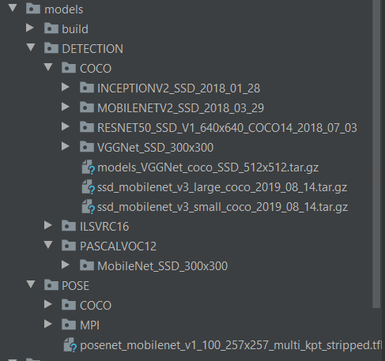

# PROJECT CONFIGURATION FILE
A default (and working) version of the `config.json` file is provided under the `config` directory in project's root directory.  
This file contains all parameters for this program and is divided into several sections, each one with a specific purpose:
* object detection models declaration
* pose estimation models declaration

***WARNING***: please note that there is no automatic validation to ensure this file is well-formed.

## 1. ADDING OBJECT DETECTION MODEL
### 1.1 Paths
Under the `detection` element, there are 2 elements to define paths where the data can be found locally:
* `models_dir_name`: path to the directory where models can be found. This can be absolute or relative. If it is relative then it should be relative to this
`config.json` file.
* `config_dir_name`: path to the directory where classes files can be found for the `detection` purpose. Again, can be absolute or relative and the same rule
applies.

Within those directory, we assume that we will find directories that have the name of the datasets models were trained on: for example `COCO`, `PASCALVOC12`, etc.
As an example, here is one directory structure:  


### 1.2 Model structure
Each model must respect this JSON format:  
```
      {
        "name": unique name you want to give to this model (example: "MobileNet_300_PASCALVOC12"),
        "folder": folder under _models_dir_name_ where this model can be found (example: "MobileNet_SSD_300x300"),
        "type": the type of model (so far only "SSD" is supported),
        "proto_file": name of the protobuf file to use for this model (example: "deploy.prototxt"),
        "weights_file": name of the weight file to load (example: "MobileNetSSD_deploy.caffemodel"),
        "image_input_size": self-explanatory: the  size of the image this model accepts as input (example: 300),
        "trained_on_dataset": the name of the dataset this model has been trained on (example: "PASCALVOC12")
      }
```
Note that the value for `trained_on_dataset` must be one of the values that is defined in the `classes` section (see after).

### 1.3 Classes
Specify here the name of the files that can be found under `config_dir_name` path for each of the trained datasets. So there must be an exact match between
all the datasets names for all the `trained_on_dataset` values and the elements in this section.  
Example:  
```
    "classes": {
      "PASCALVOC12": "voc2012.names",
      "COCO": "mscoco_labels.names",
      "ILSVRC16": "ilsvrc16_labels.names"
    }
```

## 2. ADDING POSE ESTIMATION MODEL
It works the same way for paths and classes as for object detection models. The difference remains in the `pairs` element which is a section that contains
an array of body parts id that should be connected together.  
For example for COCO: [1, 5] means that the body part with id 1 (Neck) is connected to body part with id 5 (Left Shoulder) so we can draw a line if we want
to display a skeleton.